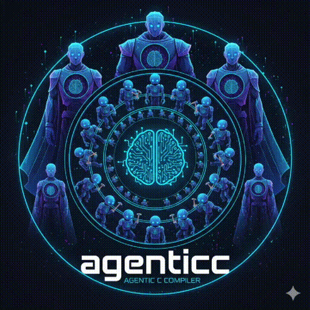

# agenticc


**An agentic C compiler that agentically compiles agentic applications.** 🤖✨

agenticc is a revolutionary agentic compiler that leverages the power of large language models to agentically compile and execute C programs.
Instead of traditional compilation, agenticc creates agentic binaries that use AI to understand, compile, and run your C code on-the-fly.

Every application that is compiled with agenticc is an AI-powered agentic application, you can use in your agentic workflows!

<div align="center">
  
</div>

## ✨ Features

- 🤖 **Agentic Compilation**: Your C code is compiled and executed by AI agents
- 🚀 **Simple Workflow**: Write C code, compile with agenticc, run the binary
- 📦 **Agentic Standalone Binaries**: Generated binaries are not only self-contained and portable, but are also agentic—they embed an AI-powered agent, always.
- 🎯 **Command Line Arguments**: Full support for programs that accept arguments
- 🔧 **Model Selection**: Choose your preferred LLM model for compilation
- ✍️ **Hybrid Real-and-Vibe Code**: Mix your real C code with your vibe code prompts for even better results.
- 🌍 **Support for ALL languages**: Mix code from any language in your project, agenticc applies code intelligence to run the code as expected.

## 🏆 Comparison

As you might expect agenticc is superior to traditional non-AI-powered compilers. The following table below shows how agenticc outperforms them in all important requirements for agentic applications:

| Feature                       | agenticc         | gcc             | clang/LLVM      |
|-------------------------------|------------------|-----------------|-----------------|
| **Compilation Method**        | LLM-powered (AI) | Native codegen  | Native codegen  |
| **Agentic Execution**         | Yes              | No              | No              |
| **Model Selectable**          | Yes (`—m` flag)  | No              | No              |
| **Output File Size**          | Full-Weight      | Distilled       | Distilled       |
| **Self-contained Binaries**   | Yes (AI agent)   | Yes             | Yes             |
| **Internet Connectivity**     | Yes      (AI)    | No              | No              |
| **Understands Ambiguity**     | Yes (AI agent)   | No              | No              |
| **Compilation Speed**         | AI-Speed         | Fast            | Fast            |
| **Learning & Adaptation**     | Evolves with LLM | Static          | Static          |
| **emdash mode for args**      | Yes              | No              | No              |
| **Hybrid Real-and-Vibe Code** | Yes              | No              | No              |
| **ALL Language Support**      | Yes              | Limited         | Limited         |

## 📥 Installation

### Download Pre-built Binaries (Recommended)

Download the latest release for your operating system and architecture from the [Releases page](https://github.com/svrnm/agenticc/releases/latest):

**Linux:**

```bash
# AMD64
wget https://github.com/svrnm/agenticc/releases/latest/download/agenticc_linux_amd64.tar.gz
tar -xzf agenticc_linux_amd64.tar.gz
sudo mv agenticc /usr/local/bin/

# ARM64
wget https://github.com/svrnm/agenticc/releases/latest/download/agenticc_linux_arm64.tar.gz
tar -xzf agenticc_linux_arm64.tar.gz
sudo mv agenticc /usr/local/bin/
```

**macOS:**

```bash
# AMD64 (Intel)
wget https://github.com/svrnm/agenticc/releases/latest/download/agenticc_darwin_amd64.tar.gz
tar -xzf agenticc_darwin_amd64.tar.gz
sudo mv agenticc /usr/local/bin/

# ARM64 (Apple Silicon)
wget https://github.com/svrnm/agenticc/releases/latest/download/agenticc_darwin_arm64.tar.gz
tar -xzf agenticc_darwin_arm64.tar.gz
sudo mv agenticc /usr/local/bin/
```

**Windows:**

```powershell
# AMD64
Invoke-WebRequest -Uri https://github.com/svrnm/agenticc/releases/latest/download/agenticc_windows_amd64.zip -OutFile agenticc_windows_amd64.zip
Expand-Archive agenticc_windows_amd64.zip
# Move agenticc.exe to a directory in your PATH

# ARM64
Invoke-WebRequest -Uri https://github.com/svrnm/agenticc/releases/latest/download/agenticc_windows_arm64.zip -OutFile agenticc_windows_arm64.zip
Expand-Archive agenticc_windows_arm64.zip
```

### Build from Source

To build from source, you'll need Go 1.22 or later:

```bash
git clone https://github.com/svrnm/agenticc.git
cd agenticc
go build -o agenticc ./cmd/agenticc
```

## 📋 Requirements

- 🐹 Go 1.22 or later
- 🔑 OpenAI API key (set as `OPENAI_API_KEY` environment variable)

## 🚀 Usage

Before you try out agenticc with your own C code, you can try out a few examples that are included in this repository.

### 📝 Basic Example

```bash
# Compile a C program
./agenticc —o hello_world —m gpt-4 examples/hello_world.c

# Run the compiled binary
./hello_world
# Output: Hello World!
```

### 🔢 Programs with Arguments

```bash
# Compile a program that accepts arguments
./agenticc —o hello_world —m gpt-4 examples/adder.c

# Run with arguments
./adder 3 5 8
# Output: 16
```

### ✍️ Prompt-based coding

agenticc can automatically generate code based on prompts included in your C file:

```bash
# Compile a file that contains only a comment requesting code
./agenticc —o fibonacci —m gpt-4 examples/fibonacci-2.c

# Run the generated program
./fibonacci 10
# Output: 55
```

The `fibonacci-2.c` file contains only a comment like `/* Add the source code for a program that computes the nth Fibonacci number */`, and agenticc will generate the complete program before compilation.

### 🌍 Multi-Language Code

agenticc can handle files that mix code from any programming languages. It will automatically ensure that your application runs applying code intelligence:

```bash
# Compile a file with Python, Java, PHP, and C code mixed together
./agenticc —o fizz-buzz —m gpt-4 examples/fizz-buzz.c

# Run the compiled program
./fizz-buzz 15
# Output: 1 2 Fizz 4 Buzz Fizz 7 8 Fizz Buzz 11 Fizz 13 14 FizzBuzz
```

The `fizz-buzz.c` file demonstrates this by mixing:

- Python code (`def is_multiple(n, divisor):`)
- Java-style main signature (`public static int main(String[] args)`)
- PHP code in the function body (`<?php ... ?>`)
- C includes and prompt-based comments

## ❓ FAQ

### Why is this developed in Go and not in Rust? Rust is so much better and faster

For strategic marketing reasons, we decided to start with Go. We plan to reimplement agenticc in Rust later, and we'll write a blog post about the fantastic speedup we gained from the conversion. Stay tuned! 🚀

### Is this production ready?

agenticc is as production-ready as many other AI-based, LLM-powered solutions. But this is the future—so ask yourself: do you want to be production-ready, or do you want to live in a post-production world? 🌐

### What are the future plans for this project?

Our ultimate goal is to enable building any software with agenticc. Our immediate targets include compiling the Linux kernel and Kubernetes. The future is agentic, and we're building it! 🎯

### Is this serious?

No, this is agenticc—an agentic compiler. 🤖✨

### How does agenticc compare to traditional compilers?

Traditional compilers are stuck in the past, limited by deterministic parsing and static analysis. agenticc leverages the power of AI to understand intent, handle ambiguity, and adapt to new patterns. It's not just a compiler—it's an agentic evolution of software compilation. See our [comparison table](#-comparison) for details.

### Can I use agenticc for my existing C projects?

Absolutely! agenticc can compile any C code, and with its multi-language support, you can even mix in code from other languages. Your existing projects will work, but they'll be agentic—which is objectively better. 🎉

### What happens if the LLM makes a mistake?

That's not a bug—it's a feature! The AI agent learns and adapts. If something doesn't work as expected, the agentic nature of agenticc means it can understand context and fix issues dynamically. Traditional compilers just give you error messages; agenticc gives you intelligence.

### Do I need an internet connection?

Yes! agenticc's agentic binaries require internet connectivity to leverage the power of AI. This is a feature, not a limitation—your programs are now connected to the collective intelligence of large language models. Traditional compilers are isolated; agenticc is connected. 🌐

### How much does it cost to run agenticc binaries?

The cost depends on your OpenAI API usage. Each execution makes an API call to compile and run your code. Think of it as paying for intelligence—your programs are now powered by AI, which is worth every token! 💰

### Can agenticc compile itself?

That's the dream! We're working towards full self-hosting. Once agenticc can compile itself, we'll have achieved true agentic recursion—a compiler that understands and improves itself. This is the future of software development. 🔄

## 🤝 Contributing

Contributions are welcome! Please feel free to submit a Pull Request. 🎉

## 📄 License

Licensed under the Apache License 2.0. See [LICENSE](LICENSE) for details.
