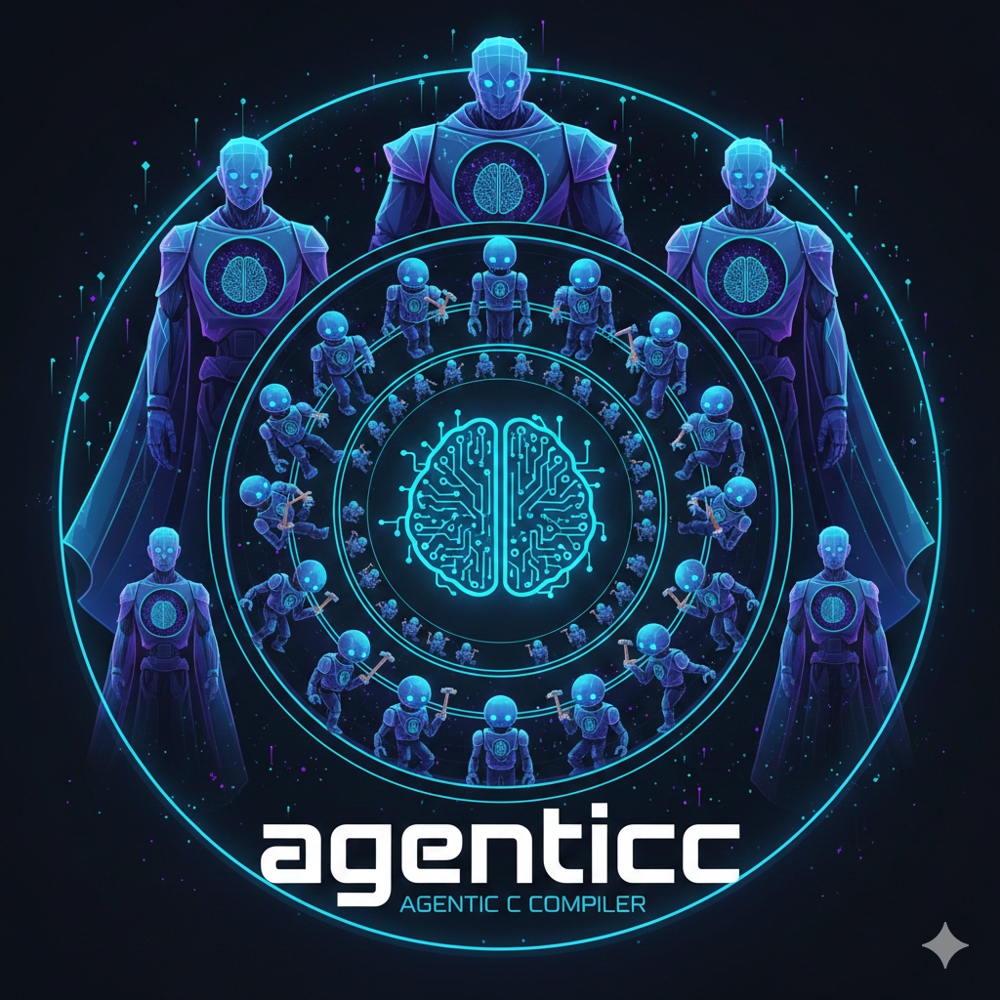

# agenticc


**An agentic C compiler that agentically compiles agentic applications.** 🤖✨

agenticc is a revolutionary agentic compiler that leverages the power of large language models to agentically compile and execute C programs.
Instead of traditional compilation, agenticc creates agentic binaries that use AI to understand, compile, and run your C code on-the-fly.

Every application that is compiled with agenticc is an AI-powered agentic application, you can use in your agentic workflows!

<div align="center">
  
</div>

## ✨ Features

- 🤖 **Agentic Compilation**: Your C code is compiled and executed by AI agents
- 🚀 **Simple Workflow**: Write C code, compile with agenticc, run the binary
- 📦 **Agentic Standalone Binaries**: Generated binaries are not only self-contained and portable, but are also agentic—they embed an AI-powered agent, always.
- 🎯 **Command Line Arguments**: Full support for programs that accept arguments
- 🔧 **Model Selection**: Choose your preferred LLM model for compilation

## 🏆 Comparison

As you might expect agenticc is superior to traditional non-AI-powered compilers. The following table below shows how agenticc outperforms them in all important requirements for agentic applications:

| Feature                       | agenticc         | gcc             | clang/LLVM      |
|-------------------------------|------------------|-----------------|-----------------|
| **Compilation Method**        | LLM-powered (AI) | Native codegen  | Native codegen  |
| **Agentic Execution**         | Yes              | No              | No              |
| **Model Selectable**          | Yes (`-m` flag)  | No              | No              |
| **Self-contained Binaries**   | Yes (AI agent)   | Yes             | Yes             |
| **Internet Connectivity**     | Yes      (AI)    | No              | No              |
| **Understands Ambiguity**     | Yes (AI agent)   | No              | No              |
| **Compilation Speed**         | AI-Speed         | Fast            | Fast            |
| **Learning & Adaptation**     | Evolves with LLM | Static          | Static          |

## 📥 Installation

### Download Pre-built Binaries (Recommended)

Download the latest release for your operating system and architecture from the [Releases page](https://github.com/svrnm/agenticc/releases/latest):

**Linux:**
```bash
# AMD64
wget https://github.com/svrnm/agenticc/releases/latest/download/agenticc_linux_amd64.tar.gz
tar -xzf agenticc_linux_amd64.tar.gz
sudo mv agenticc /usr/local/bin/

# ARM64
wget https://github.com/svrnm/agenticc/releases/latest/download/agenticc_linux_arm64.tar.gz
tar -xzf agenticc_linux_arm64.tar.gz
sudo mv agenticc /usr/local/bin/
```

**macOS:**
```bash
# AMD64 (Intel)
wget https://github.com/svrnm/agenticc/releases/latest/download/agenticc_darwin_amd64.tar.gz
tar -xzf agenticc_darwin_amd64.tar.gz
sudo mv agenticc /usr/local/bin/

# ARM64 (Apple Silicon)
wget https://github.com/svrnm/agenticc/releases/latest/download/agenticc_darwin_arm64.tar.gz
tar -xzf agenticc_darwin_arm64.tar.gz
sudo mv agenticc /usr/local/bin/
```

**Windows:**
```powershell
# AMD64
Invoke-WebRequest -Uri https://github.com/svrnm/agenticc/releases/latest/download/agenticc_windows_amd64.zip -OutFile agenticc_windows_amd64.zip
Expand-Archive agenticc_windows_amd64.zip
# Move agenticc.exe to a directory in your PATH

# ARM64
Invoke-WebRequest -Uri https://github.com/svrnm/agenticc/releases/latest/download/agenticc_windows_arm64.zip -OutFile agenticc_windows_arm64.zip
Expand-Archive agenticc_windows_arm64.zip
```

### Build from Source

To build from source, you'll need Go 1.22 or later:

```bash
git clone https://github.com/svrnm/agenticc.git
cd agenticc
go build -o agenticc ./cmd/agenticc
```

## 📋 Requirements

- 🐹 Go 1.22 or later
- 🔑 OpenAI API key (set as `OPENAI_API_KEY` environment variable)

## 🚀 Usage

Before you try out agenticc with your own C code, you can try out a few examples that are included in this repository.

### 📝 Basic Example

```bash
# Compile a C program
./agenticc examples/hello_world.c -o hello_world -m gpt-4

# Run the compiled binary
./hello_world
# Output: Hello World!
```

### 🔢 Programs with Arguments

```bash
# Compile a program that accepts arguments
./agenticc examples/adder.c -o adder -m gpt-4

# Run with arguments
./adder 3 5 8
# Output: 16
```

### ⚙️ Command Line Options

- `-o <output>`: Specify the output binary name (required)
- `-m <model>`: Specify the OpenAI model to use (default: `gpt-4`)

## 📚 Examples

The `examples/` directory contains several example C programs:

- 📄 **hello_world.c**: A simple "Hello World" program
- ➕ **adder.c**: Adds command-line arguments together
- 🔢 **fibonacci.c**: Computes the nth Fibonacci number

## 🔐 Environment Variables

- `OPENAI_API_KEY`: Your OpenAI API key (required for running compiled binaries)

## 🤝 Contributing

Contributions are welcome! Please feel free to submit a Pull Request. 🎉

## 📄 License

Licensed under the Apache License 2.0. See [LICENSE](LICENSE) for details.
